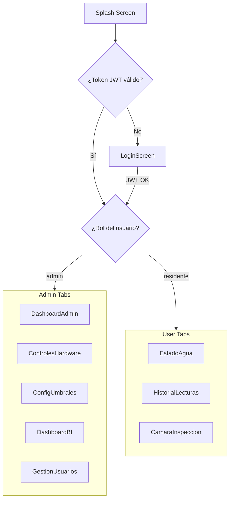
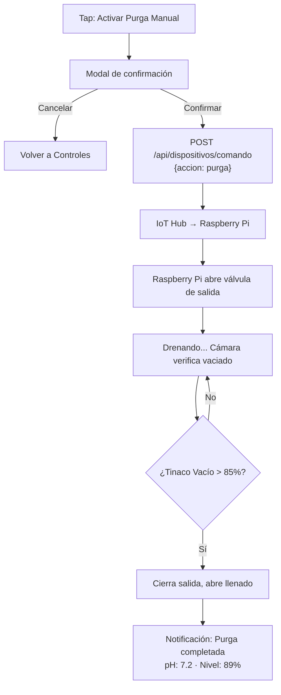
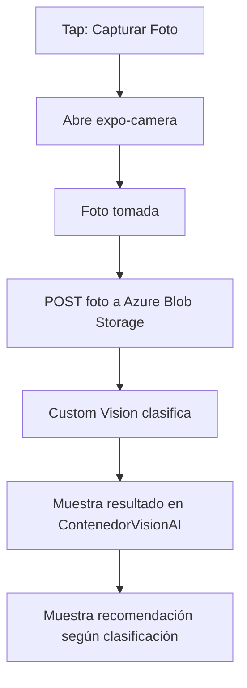
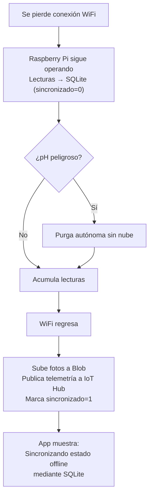

# 05 — Flujos de Navegación

## Flujo Principal

```mermaid
flowchart TD
    SPLASH["Splash Screen"] --> AUTH{"¿Token JWT válido?"}
    AUTH -->|No| LOGIN["LoginScreen"]
    AUTH -->|Sí| ROLE{"¿Rol del usuario?"}
    LOGIN -->|JWT OK| ROLE
    ROLE -->|admin| ADMIN_TABS["AdminTabNavigator"]
    ROLE -->|residente| USER_TABS["UserTabNavigator"]

    subgraph ADMIN_TABS["Admin Tabs"]
        A1["DashboardAdmin"]
        A2["ControlesHardware"]
        A3["ConfigUmbrales"]
        A4["DashboardBI"]
        A5["GestionUsuarios"]
    end

    subgraph USER_TABS["User Tabs"]
        U1["EstadoAgua"]
        U2["HistorialLecturas"]
        U3["CamaraInspeccion"]
    end
```

## Flujo de Purga Manual (Solo Admin)

```mermaid
flowchart TD
    BTN["Tap: Activar Purga Manual"] --> CONFIRM["Modal de confirmación"]
    CONFIRM -->|Cancelar| BACK["Volver a Controles"]
    CONFIRM -->|Confirmar| SEND["POST /api/dispositivos/comando\n{accion: purga}"]
    SEND --> IOT["IoT Hub → Raspberry Pi"]
    IOT --> PURGE["Raspberry Pi abre válvula de salida"]
    PURGE --> DRAIN["Drenando... Cámara verifica vaciado"]
    DRAIN --> EMPTY{"¿Tinaco Vacío > 85%?"}
    EMPTY -->|No| DRAIN
    EMPTY -->|Sí| FILL["Cierra salida, abre llenado"]
    FILL --> DONE["Notificación: Purga completada\npH: 7.2 · Nivel: 89%"]
```

## Flujo de Foto desde Celular (Ambos Roles)

```mermaid
flowchart TD
    TAP["Tap: Capturar Foto"] --> CAMERA["Abre expo-camera"]
    CAMERA --> CAPTURE["Foto tomada"]
    CAPTURE --> UPLOAD["POST foto a Azure Blob Storage"]
    UPLOAD --> CV["Custom Vision clasifica"]
    CV --> RESULT["Muestra resultado en ContenedorVisionAI"]
    RESULT --> REC["Muestra recomendación según clasificación"]
```

## Flujo Offline → Online

```mermaid
flowchart TD
    LOSS["Se pierde conexión WiFi"] --> LOCAL["Raspberry Pi sigue operando\nLecturas → SQLite (sincronizado=0)"]
    LOCAL --> PURGE{"¿pH peligroso?"}
    PURGE -->|Sí| AUTO["Purga autónoma sin nube"]
    PURGE -->|No| WAIT["Acumula lecturas"]
    AUTO --> WAIT
    WAIT --> RECONNECT["WiFi regresa"]
    RECONNECT --> SYNC["Sube fotos a Blob\nPublica telemetría a IoT Hub\nMarca sincronizado=1"]
    SYNC --> NOTIFY["App muestra:\nSincronizando estado offline\nmediante SQLite"]
```
